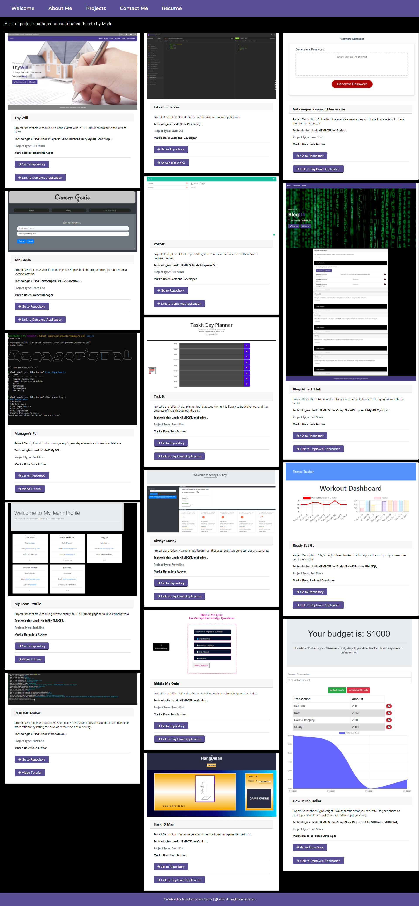

## Welcome to Mark's Awesome World 👋

### Who is Mark Forester?

**Multi-skilled full-stack web developer and contracts manager leveraging a background in mechanical engineering to provide unique perspectives on how end-users interact with websites and software platforms. Earned a certificate in Full Stack Web Development from the University of Sydney Coding Boot Camp preceded by a full scholarship at Petronas University of Technology. Innovative problem-solver, passionate about developing apps with a focus on mobile-first design and development. Strengths in creativity, teamwork, and building projects from ideation to execution. Exceptional leadership characteristics in day-to-day work and when managing teams.**

<!--
**Forester93/forester93** is a ✨ _special_ ✨ repository because its `README.md` (this file) appears on your GitHub profile.

Here are some ideas to get you started:

- 🔭 I’m currently working on ...
- 🌱 I’m currently learning ...
- 👯 I’m looking to collaborate on ...
- 🤔 I’m looking for help with ...
- 💬 Ask me about ...
- 📫 How to reach me: ...
- 😄 Pronouns: ...
- ⚡ Fun fact: ...
-->

## Contents

• [Aspirations](#aspirations)
• [Technologies](#technologies)
• [Links](#links)
• [Questions](#questions)

## Aspirations

I am aspiring to build a turnkey-solution organisations for firms to materialise ideas that will change the world.

### Technologies

I am quite proficient in using the following technologies:

⚡ HTML5  
⚡ CSS  
⚡ JavaScript  
⚡ JQuery  
⚡ Bootstrap  
⚡ NodeJS  
⚡ MySQL  
⚡ NoSQL

## Links

[Mark Forester's Portfolio Deployed Webpage](https://Forester93.github.io/MarkForesterPortfolio/)

[Resume](https://forester93.github.io/MarkForesterPortfolio/assets/files/MarkF_FullStackResume.pdf)

[My LinkedIn Account](https://www.linkedin.com/in/mforester93/)

[Mark Forester Github Profile](https://github.com/Forester93/)

## Questions

📫📫 You can reach out to me over one of the following.

| Name          | Email                    | Phone Number        |
| ------------- | ------------------------ | ------------------- |
| Mark Forester | markforester93@gmail.com | +61-(0)-404-831-362 |
